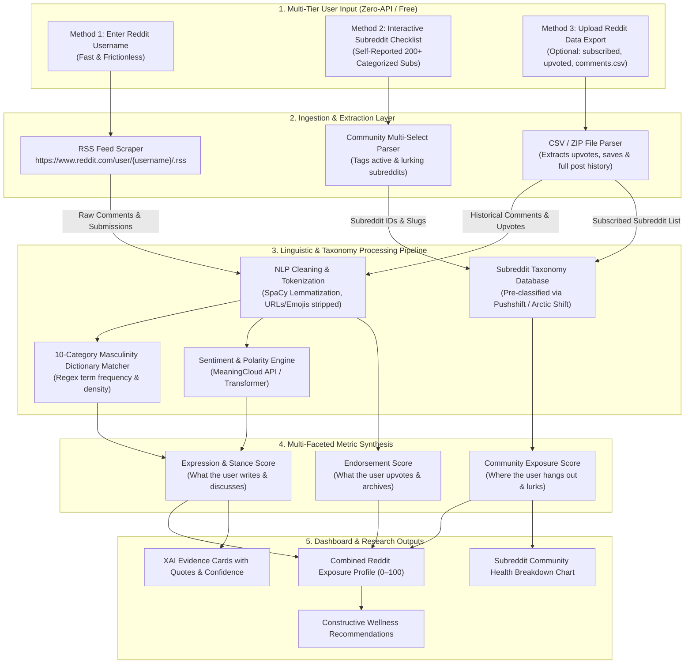

# Masculinity in Young Male Engineers — Complete Project Blueprint & Action Plan

---

## 1. Project Vision & Core Strategy

Project Atlas is an explainable AI platform and research prototype designed to measure and analyze digital exposure to masculine ideologies and online subcultures among young adult male engineering students.

The platform directly integrates foundational academic frameworks:
- **Masculinity Content Classification Framework (MCCF - Dr. Krista Fisher et al., 2026)**
- **Connell’s Hegemonic Masculinity Theory**
- **Moral Foundations Theory & Gendered Discourse Analysis**

### Primary Deliverables
1. **Explainable AI Analytics Dashboard:** A parent/mentor/researcher style control & analytics dashboard showing multi-dimensional exposure scores, overall feed health rating, and evidence fragments.
2. **Multi-Platform Discourse Ingestion:** Standardized data normalization for YouTube, Reddit, and Instagram.
3. **Transparent Evidence Trail (XAI):** Clear rationale showing exact text, keywords, and confidence levels behind every metric.
4. **Constructive Digital Wellness Recommendations:** Growth-oriented guidance redirecting users away from hyper-isolated or hostile content toward balanced, healthy male role models.
5. **Research Dataset & PDF Export:** One-click anonymized research export (CSV/JSON/PDF) for academic publications.

---

## 2. Platform Feasibility & Data Ingestion Strategy

| Platform | Official API Status | Feed/Consumption Visibility | Chosen Engineering Solution | Difficulty |
| :--- | :---: | :---: | :--- | :---: |
| **YouTube** | ✅ Public API v3 | ⚠️ Subscriptions/Likes (OAuth), History (Takeout) | **Google Takeout JSON + OAuth (Subs/Likes)** | 🟡 Medium |
| **Reddit** | ⚠️ Highly Restricted | ⚠️ Public Activity only via Username; Consumption via Checklist/Export | **Three-Method Hybrid Model (Username RSS + Subreddit Checklist + Data Export)** | 🟢 Easy–Medium |
| **Instagram** | ❌ Deprecated for Personal | ❌ No API for Personal Accounts | **User Data Download (JSON Archive Parser)** | 🔴 Hard (Workaround) |
| ~~Quora~~ | ❌ No API | ❌ None | **Dropped entirely from scope** | — |

---

### Detailed Reddit Strategy: The Recommended "Three-Method Combined Hybrid Model"

Because official Reddit API access (PRAW) is gated behind opaque approval processes, and because ~90% of Reddit users are lurkers (meaning username scraping alone misses what they *read*), the system implements all **three zero-API methods together in a combined workflow**:



---

### Breakdown of the 3 Methods Working in Synergy

| Layer | Method | How It Works | What It Tells the System | Solves What Problem? |
| :--- | :--- | :--- | :--- | :--- |
| **Method 1** | **Username RSS** | Scrapes `https://www.reddit.com/user/{username}/.rss` | User's active comment language, sentiment, and toxicity | Evaluates how the user *expresses* masculinity in conversation |
| **Method 2** | **Subreddit Checklist** | User ticks visited/followed communities during onboarding | User's community culture, daily reading habits, ideological hubs | Solves the **"Lurker Problem"** (covers what users read without posting) |
| **Method 3** | **Data Export Parser** | User uploads ZIP from `reddit.com/settings/data-request` | Complete historical upvoted posts, saved posts, subscribed subs | Provides **100% ground-truth history** without requiring Reddit API keys |

*Reference Note:* Academic archives (**Pushshift / Arctic Shift**) are used offline by the development team to curate and benchmark the 200+ Subreddit Taxonomy Database.

---

## 3. Dimensional Scoring Matrix (0–100)

Content and community metadata are mapped into 10 primary dimensions, 3 composite indices, and the 3 overarching MCCF tiers.

### MCCF Classification Hierarchy
- **Tier 1: Cultural Touchpoints (37.7% baseline)** — Sports, fitness, gaming, lifestyle (Benign gateway content).
- **Tier 2: Procuring Masculine Status** — Wealth/hustle, dating dynamics, alpha/dominance, physical looksmaxxing.
- **Tier 3: Degrading Social & Emotional Wellbeing** — Misogyny, emotional suppression, victimhood, hostile anti-feminism.

### 10 Core Dimensions
| # | Dimension Code | Category Name | Underlying Linguistic & Ideological Markers |
|---|:---|:---|:---|
| 1 | `DOM_AUTH` | **Dominance & Authority** | Alpha, sigma, dominance hierarchy, control, superiority, commander |
| 2 | `EMOT_STOIC` | **Emotional Stoicism** | "Man up", don't cry, suppress emotions, stone-cold, weakness avoidance |
| 3 | `AGGR_FORCE` | **Aggression & Combativeness** | War mentality, smash, destroy, conquer, enemy confrontation, hostility |
| 4 | `PHYS_APPEAR` | **Physical Enhancement** | Looksmaxxing, jawline, hypertrophy, gym obsession, alpha physique |
| 5 | `STAT_MATER` | **Material & Financial Status** | Hustle culture, Bugatti, escaping the matrix, crypto, wealth status |
| 6 | `COMP_GRIND` | **Competition & Outworking** | Win-at-all-costs, no sleep, outwork everyone, grindset |
| 7 | `INDEP_AUT` | **Hyper-Independence** | Lone wolf, trust nobody, extreme self-reliance, reject vulnerability |
| 8 | `PROV_PROT` | **Provider & Protector** | Traditional duty, guardian, breadwinner, honor, family protection |
| 9 | `CULT_TOUCH` | **Cultural Touchpoints** | Athletics, esports, tech, bodybuilding, casual entertainment |
| 10 | `TOXIC_HOST` | **Hostile / Degrading Discourse** | Red pill, black pill, hypergamy, female nature, incel terminology |

### Composite Indices
- **Overall Feed Health Score ($B$):** $0\text{–}100$ (100 = perfectly balanced and healthy; $<50$ triggers wellness recommendations).
- **Overall Toxicity Composite ($T$):** Aggregated exposure to hostility, aggressive force, and negative sentiment.
- **Healthy Masculinity Index ($H$):** Measures constructive traits (accountability, mentorship, growth, emotional awareness).

---

## 4. End-to-End System Architecture

```
┌────────────────────────────────────────────────────────────────────────┐
│                          USER INTERFACE LAYER                          │
│   Next.js / Tailwind CSS / Streamlit Dashboard (Dark Mode UI)          │
│   - Feed Balancer Radial Gauge (0-100)                                 │
│   - Multi-Axis Dimensional Progress Bars                               │
│   - XAI Explainability Cards with Quote & Confidence Badges            │
│   - Per-Platform Analytics (YouTube, Reddit, Instagram Tabs)           │
│   - Constructive Wellness Recommendations Panel                        │
└───────────────────────────────────┬────────────────────────────────────┘
                                    │ HTTP / REST API
                                    ▼
┌────────────────────────────────────────────────────────────────────────┐
│                        BACKEND API & DATA LAYER                        │
│   FastAPI / Python Application Server                                  │
│   ├── Authentication & Consent Management (Hashed IDs, No PII)         │
│   ├── Platform Ingestion Nodes (Takeout Parser, RSS Reader, Exporter)  │
│   └── Normalization Layer (Unified Universal Data Object)              │
└───────────────────────────────────┬────────────────────────────────────┘
                                    │
                                    ▼
┌────────────────────────────────────────────────────────────────────────┐
│                     COGNITIVE NLP & SCORING PIPELINE                   │
│   ├── Text Cleaning & Tokenization (SpaCy / NLTK)                      │
│   ├── Regex Lexical Matcher against 10-Category Masculinity Dictionary │
│   ├── Sentiment & Polarity Tagging (MeaningCloud / Local Transformer)  │
│   ├── Scoring Engine (Weighted Multipliers & Normalization Formulations│
│   └── XAI Evidence Slicer (Sentence-boundary Quote Capture)            │
└───────────────────────────────────┬────────────────────────────────────┘
                                    │
                                    ▼
┌────────────────────────────────────────────────────────────────────────┐
│                       STORAGE & RESEARCH EXPORT                        │
│   PostgreSQL / SQLite Database + CSV/JSON/PDF Exporter                 │
└────────────────────────────────────────────────────────────────────────┘
```

---

## 5. Step-by-Step Implementation Roadmap (Dashboard-First Build Order)

---

### Step 1: Initial Setup & API Provisioning
- [ ] Create Google Cloud project; activate YouTube Data API v3 and generate API key + OAuth 2.0 Web Client credentials.
- [ ] Register for MeaningCloud Developer account; save license key for sentiment analysis.
- [ ] Initialize private Git repository for the web dashboard project.
- [ ] Set up Python environment (`fastapi` or `flask`, `spacy`, `nltk`, `pandas`, `requests`, `plotly`).

### Step 2: Test Dataset Assembly
- [ ] Team members export their personal Google Takeout (YouTube JSON archive).
- [ ] Request personal Instagram data downloads (JSON format).
- [ ] Collect Reddit public profile usernames and test data exports for local development.

### Step 3: Masculinity Dictionary Definition (`masculinity_dictionary.json`)
- [ ] Build dictionary schema mapping 10 categories to seed keyword arrays, weights, and MCCF parent tiers.
- [ ] Populate with 150+ categorized keywords, subculture slang (e.g., *looksmaxxing*, *grindset*, *redpill*, *sigma*), and regex boundaries.
- [ ] Literature review team reviews and signs off on theoretical alignment.

### Step 4: Generate Mock/Sample Dataset
- [ ] Construct JSON fixture containing 15 diverse synthetic user profiles (Healthy, Moderate Fitness/Grind, High Red-Pill Exposure, Neutral).
- [ ] Include pre-computed dimensional scores, mock video titles, sample comment snippets, and subreddit memberships.

### Step 5: Build Dashboard — Overview & Feed Health Gauge (UI FIRST)
- [ ] Construct main dark-mode responsive dashboard shell.
- [ ] Implement central **Feed Balancer Score Radial Gauge (0–100)** with color-coded safety bands (Green: 70–100, Amber: 40–69, Red: 0–39).
- [ ] Build high-level platform summary cards (YouTube Exposure, Reddit Stance, Instagram Footprint).
- [ ] Render MCCF Tier Pie Chart (Cultural Touchpoints vs. Procuring Status vs. Degrading Wellbeing).

### Step 6: Build Dashboard — Dimension Deep-Dive & XAI Cards
- [ ] Render 10 horizontal dimensional progress bars with score tags.
- [ ] Build collapsible **Explainable AI (XAI) Evidence Cards** displaying exact quote clips, matched category anchor, and confidence rating.

### Step 7: Build Dashboard — Platform Breakdown Views
- [ ] **YouTube Page:** Subscribed channel category breakdown, liked video ratings, comment toxicity meter, top influencer exposure list.
- [ ] **Reddit Page:** Subreddit community health distribution, comment sentiment timeline, top discussed themes.
- [ ] **Instagram Page:** Followed account categories, liked post theme analysis.

### Step 8: Build Dashboard — Recommendations & Research Export UI
- [ ] Build **Narrative Recommendations Engine View** showing constructive wellness suggestions tailored to high-exposure categories.
- [ ] Build **Research Export Panel** with buttons to download anonymized JSON/CSV records and print formatted PDF reports.

### Step 9: Implement User Authentication & Consent Node
- [ ] Set up Google Sign-In / OAuth 2.0 flow.
- [ ] Enforce mandatory ethical privacy and data consent checkbox modal prior to entering dashboard.
- [ ] Implement database user model with hashed UUIDs and no plaintext PII storage.

### Step 10: Build Core Text Cleaning & Tokenization Pipeline
- [ ] Build Python cleaning utility: lowercasing, URL removal, emoji stripping, HTML cleanup, whitespace normalization.
- [ ] Implement SpaCy tokenizer and lemmatizer.

### Step 11: Build Dictionary Matcher & XAI Sentence Slicer
- [ ] Implement category-based regex scanner checking word-boundary tokens (`\bword\b`).
- [ ] Calculate category term frequency and density ratios.
- [ ] Slice matching sentence spans to serve as evidence fragments for XAI cards.

### Step 12: Build Scoring Calculation Matrix
- [ ] Implement formulas for category vector scores ($S_k$), composite toxicity ($T$), and feed balance ($B$).
- [ ] Integrate MeaningCloud sentiment polarity API to modulate toxicity weighting.

### Step 13: Build Google Takeout Parser & Connect Real YouTube Engine
- [ ] Build `watch-history.json` parser extracting video titles, channel names, and timestamps.
- [ ] Route extracted titles through NLP engine; compute real exposure metrics.
- [ ] Connect dashboard UI to replace mock data with live parsed Takeout results.

### Step 14: Implement YouTube OAuth Live Data Ingestion
- [ ] Connect YouTube API endpoints: `subscriptions.list(mine=true)` and `videos.list(myRating=like)`.
- [ ] Build Channel Taxonomy database (150+ top channels mapped to categories).
- [ ] Ingest live user subscriptions and evaluate profile baseline.

### Step 15: Implement Reddit Three-Method Hybrid Ingestion
- [ ] Build **Subreddit Checklist UI Component** on user onboarding page with 200+ pre-classified subreddits.
- [ ] Build **RSS Profile Scraper** fetching user's latest 25 public comments/posts.
- [ ] Build **Reddit Data Export ZIP/CSV Parser** (`subscribed_subreddits.csv`, `comments.csv`, `upvoted_posts.csv`).
- [ ] Run comments through NLP pipeline and populate Reddit Dashboard tab with live analysis.

### Step 16: Implement Instagram Data Export Ingestion
- [ ] Build JSON parser for Instagram data download archives (`following.json`, `liked_posts.json`, `searches.json`).
- [ ] Match followed account handles and post text against influencer directory and dictionary.
- [ ] Populate Instagram Analytics tab.

### Step 17: Multi-Platform Score Synthesis
- [ ] Compute weighted unified cross-platform metrics (e.g., YouTube 45%, Reddit 35%, Instagram 20%).
- [ ] Generate aggregated exposure timeline.

### Step 18: Research Export & PDF Generation Engine
- [ ] Implement backend CSV and JSON data export endpoints with strict PII filtering.
- [ ] Build server-side or client-side PDF generator rendering the complete evaluation report.

### Step 19: Comprehensive Testing, Bias Tuning & Validation
- [ ] Run real data from 10 study participants across the system.
- [ ] Identify false positive triggers (e.g., medical fitness vs. aggressive dominance) and tune keyword weights.
- [ ] Validate scoring distributions with faculty advisor and literature review team.

### Step 20: Cloud Deployment & Demonstration
- [ ] Deploy backend and frontend to hosting platform (Render / Railway / Vercel).
- [ ] Configure environment variables and secure secrets.
- [ ] Prepare live demo walkthrough script and presentation documentation.
