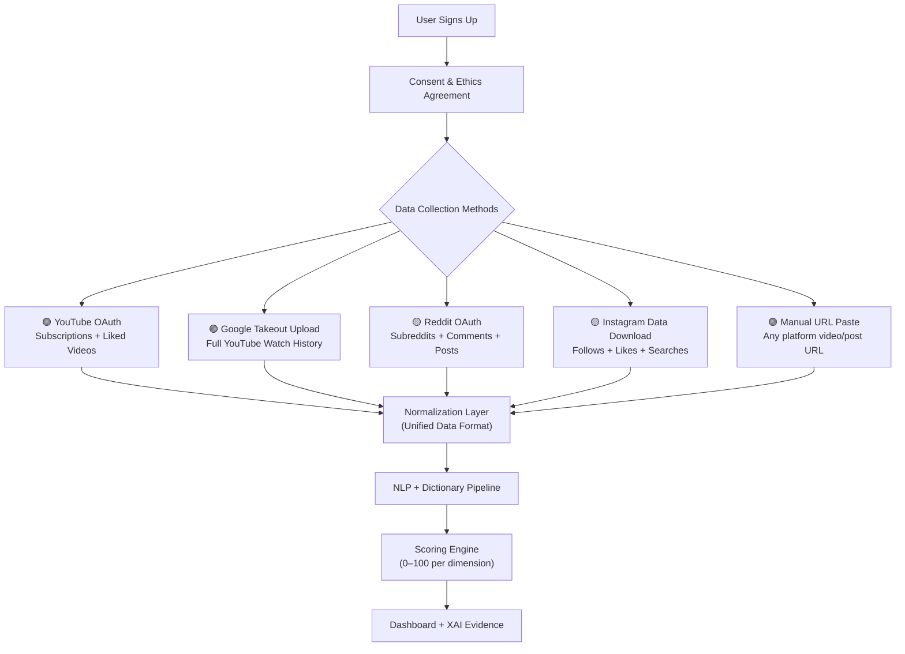

# Masculinity in Young Male Engineers — Prototype Feasibility & Blueprint

## 1. Project Vision

Build a **web-based analytical dashboard** (similar to a parental control panel) where young male engineering students can connect their social media accounts (YouTube, Instagram, Reddit, Quora). The platform analyzes the content they consume, classifies it using academic masculinity frameworks, and produces:

- **Toxicity & safety scores** per platform and overall
- **Multi-dimensional masculinity exposure metrics** (stoicism, dominance, aggression, etc.)
- **Explainable evidence** (exact content that triggered scores)
- **Wellness recommendations** (constructive, not shaming)
- **Research-exportable data** for academic publication

> [!IMPORTANT]
> This is a **research prototype** — not a consumer product. Your primary users are researchers and consenting study participants. This framing simplifies ethics, reduces the "why would anyone use this?" problem, and aligns with academic publication goals.

---

## 2. Platform-by-Platform Feasibility

This is where reality hits. Each platform has very different API access, and this fundamentally shapes what you can build.

### Feasibility Summary Table

| Platform | Official API? | Can Access User Feed/History? | Difficulty | Prototype Viability |
|----------|:---:|:---:|:---:|:---:|
| **YouTube** | ✅ Yes | ⚠️ Partial (not watch history) | 🟡 Medium | ✅ Strong |
| **Reddit** | ⚠️ Restricted | ⚠️ Partial (public activity only) | 🟡 Medium | ✅ Viable |
| **Instagram** | ⚠️ Very limited | ❌ No (personal accounts blocked) | 🔴 Hard | ⚠️ Workaround needed |
| **Quora** | ❌ No API | ❌ No | 🔴 Very Hard | ❌ Drop or deprioritize |

---

### 2.1 YouTube — ✅ Best Platform to Start

**What's Available:**
| Data Type | Access Method | Feasibility |
|-----------|--------------|:-----------:|
| Video metadata (title, tags, description, category) | YouTube Data API v3 (`videos.list`) | ✅ Easy |
| Video comments (top 100) | YouTube Data API v3 (`commentThreads.list`) | ✅ Easy |
| Channel info | YouTube Data API v3 (`channels.list`) | ✅ Easy |
| Video transcripts/captions | Unofficial (`youtube-transcript-api` Python library) | ⚠️ Works but fragile |
| **User's watch history** | **❌ NOT available via API** | ❌ Blocked |
| User's subscriptions | YouTube Data API v3 with OAuth | ✅ With user consent |
| User's liked videos | YouTube Data API v3 with OAuth | ✅ With user consent |

**The Watch History Problem:**
YouTube Data API v3 **does not expose watch history** — this is the biggest limitation. Your workarounds are:

1. **Google Takeout** (Recommended for research): Users export their YouTube data as JSON from [takeout.google.com](https://takeout.google.com). Your site parses the uploaded file. This is **privacy-safe, legal, and gives full history**.
2. **Analyze subscriptions + liked videos**: Use OAuth to read what channels they subscribe to and what videos they've liked — this is a strong proxy for consumption patterns.
3. **Manual URL paste**: Users paste specific video URLs for analysis (simplest but lowest coverage).
4. **Browser extension** (your existing repo): Captures watch activity in real-time — but desktop only.

> [!TIP]
> **Recommended approach for prototype:** Combine **Google Takeout upload** (for historical data) + **OAuth for subscriptions/liked videos** (for live data). This gives you the most coverage legally.

**API Quota:** 10,000 units/day free. `videos.list` = 1 unit, `commentThreads.list` = 5 units. Budget for ~1,500–2,000 video analyses per day.

**Difficulty: 🟡 Medium** — Your Chrome extension repo already handles most of the YouTube analysis logic. Adapting it to a web backend is straightforward.

---

### 2.2 Reddit — ✅ Viable Second Platform

**What's Available:**
| Data Type | Access Method | Feasibility |
|-----------|--------------|:-----------:|
| User's public posts | Reddit API (OAuth) | ✅ With approval |
| User's public comments | Reddit API (OAuth) | ✅ With approval |
| User's subscribed subreddits | Reddit API (OAuth) | ⚠️ Limited |
| Subreddit content analysis | Reddit API (public) | ✅ Free tier |
| User's upvote/downvote history | ❌ Private | ❌ Blocked |
| User's saved posts | ⚠️ Requires OAuth + user consent | ⚠️ Limited |

**Key Constraints:**
- Reddit's API now requires **"Responsible Builder" approval** — no more self-serve registration
- Free tier: **100 queries per minute**, non-commercial only
- Academic access exists but the application process is slow and opaque
- Alternative: Users can export their Reddit data via [reddit.com/settings/data-request](https://www.reddit.com/settings/data-request)

**What You Can Analyze:**
- **Subreddit subscriptions** → Map to masculinity categories (e.g., r/TheRedPill = TOXIC_HOST, r/fitness = CULT_TOUCH, r/MensLib = healthy masculinity)
- **Comment text** → Run through your masculinity dictionary + NLP pipeline
- **Post engagement** → What kind of content they create/interact with

> [!TIP]
> **Recommended approach:** Build a **subreddit classification database** — manually categorize the top 500–1,000 masculinity-relevant subreddits into your MCCF categories. Then analyze which ones the user follows. Supplement with comment text analysis.

**Difficulty: 🟡 Medium** — API access is the bottleneck, not the tech. If academic approval is slow, use Reddit data export as fallback.

---

### 2.3 Instagram — ⚠️ Hardest Platform

**What's Available:**
| Data Type | Access Method | Feasibility |
|-----------|--------------|:-----------:|
| User's own posts/media | Instagram Graph API (Business/Creator accounts ONLY) | ⚠️ Account type restriction |
| User's feed/Reels consumption | ❌ No API at all | ❌ Blocked |
| Comments on user's posts | Instagram Graph API (Business/Creator only) | ⚠️ Limited |
| Hashtag search | Instagram Graph API | ⚠️ Limited scope |
| Personal account data | ❌ Basic Display API deprecated Dec 2024 | ❌ Dead |

**The Hard Truth:**
Instagram is the **most consumed platform by young men** (especially Reels), but Meta has made it nearly impossible for third-party apps to access personal user data. There is **no official API** that lets you see what Reels or posts a personal account user watches.

**Workarounds for Prototype:**

1. **Instagram Data Download** (Best option): Users go to Instagram → Settings → Your Activity → Download Your Information → Request data in JSON format. Your site parses the uploaded file (contains liked posts, saved posts, searches, ads interactions, followed accounts).

2. **Manual link paste**: Users paste links to specific Instagram accounts/posts they follow. You analyze the public profile and recent posts of those accounts.

3. **Account-follows analysis**: If users provide their followed accounts list (from the data download), you categorize those accounts (e.g., Andrew Tate = TOXIC_HOST, fitness influencer = PHYS_APPEAR).

4. **Skip Instagram for MVP**: Focus on YouTube and Reddit first. Add Instagram in Phase 2 using the data download approach.

> [!WARNING]
> **Do NOT build a scraper for Instagram.** It violates Meta's ToS, is legally risky, and will get IP-banned immediately. Stick to user-uploaded data exports.

**Difficulty: 🔴 Hard** — Not technically hard, but the data access problem is severe. The data download workaround is viable for a research prototype.

---

### 2.4 Quora — ❌ Recommend Dropping

**What's Available:**
| Data Type | Access Method | Feasibility |
|-----------|--------------|:-----------:|
| Everything | ❌ No public API whatsoever | ❌ None |

**The Reality:**
- Quora has **zero public API** for content access
- Scraping violates their ToS and they have aggressive anti-bot detection
- Quora's user base among young male engineers is relatively small compared to YouTube/Reddit/Instagram
- The effort-to-value ratio is terrible

> [!CAUTION]
> **Strong recommendation: Drop Quora entirely.** Replace it with **X (Twitter)** or **TikTok** — both have better API access and are far more relevant to manosphere content consumption among young men.

**If you insist on Quora:** The only viable path is asking users to manually export/screenshot their Quora activity, which has very low participation rates.

---

## 3. Recommended Data Collection Strategy

Given platform constraints, here's the pragmatic approach:



### The "Dual Input" Model

| Input Method | Platforms | Depth | User Effort |
|-------------|-----------|-------|-------------|
| **OAuth Connect** | YouTube, Reddit | Live subscriptions, recent activity | Low (click to authorize) |
| **Data Export Upload** | YouTube (Takeout), Instagram, Reddit | Full historical data | Medium (download + upload) |
| **Manual URL Paste** | Any platform | Single item analysis | Low but limited scope |

> This dual approach gives you the best coverage while staying completely legal and ethical.

---

## 4. Proposed Features & Dashboard Design

### 4.1 Core Features (Must-Have for MVP)

| Feature | Description | Grounded In |
|---------|-------------|------------|
| **User Onboarding** | Sign up, consent form, connect accounts / upload data exports | Tentative Strategy (Module 1) |
| **Platform Connectors** | YouTube OAuth + Takeout parser, Reddit OAuth, Instagram export parser | Tentative Strategy (Module 2-3) |
| **Content Analysis Engine** | NLP pipeline: clean text → dictionary match → sentiment → entity detection | Tentative Strategy (Module 4-6), Chrome Extension repo |
| **Multi-Dimensional Scoring** | 0–100 scores across 10+ masculinity dimensions | MCCF, Connell's Theory, Expert Meeting corpus |
| **Overall Feed Health Score** | Composite "Feed Balancer" score (higher = healthier) | Chrome Extension scoring formulas |
| **Explainability Cards** | "Why this score?" — show exact flagged content + category + confidence | Tentative Strategy (Module 8) |
| **Per-Platform Breakdown** | Separate analysis for YouTube vs Reddit vs Instagram | Tech Roadmap architecture |
| **Toxicity & Safety Alerts** | Flag high-risk content exposure with color-coded warnings | Tech Roadmap (Risk Alerts) |

### 4.2 Dashboard Pages

| Page | What It Shows |
|------|--------------|
| **🏠 Home / Overview** | Overall Feed Health score (big gauge), platform breakdown cards, quick risk summary |
| **📊 YouTube Analysis** | Subscription category breakdown, liked video analysis, comment toxicity, top influencers followed, timeline trends |
| **📊 Reddit Analysis** | Subreddit category map, comment sentiment analysis, engagement patterns, community health scores |
| **📊 Instagram Analysis** | Followed accounts classification, liked content themes, search history patterns |
| **📈 Trends & Timeline** | How exposure changes over time (weekly/monthly), progression tracking |
| **🎯 Dimension Deep-Dive** | Detailed view of each scoring dimension (Stoicism, Dominance, etc.) with evidence cards |
| **💡 Recommendations** | Constructive wellness suggestions based on exposure patterns |
| **⚙️ Settings** | API keys, connected accounts, privacy controls, data export |
| **📤 Research Export** | CSV/JSON download of anonymized analysis data for academic use |

### 4.3 Additional Recommended Features

| Feature | Why Include It | Difficulty |
|---------|---------------|:----------:|
| **Influencer Mapping** | Show which masculinity influencers appear most in the user's feed (Andrew Tate, Jordan Peterson, fitness gurus, etc.) | 🟡 Medium |
| **Content Pipeline Visualization** | Show the "rabbit hole" — how cultural touchpoints connect to more extreme content (inspired by Dr. Fisher's research) | 🟡 Medium |
| **Peer Comparison** (anonymized) | "Your feed is healthier than 65% of participants" — aggregated, anonymous benchmarking | 🟡 Medium |
| **MCCF Category Breakdown** | Pie chart: what % of content is Cultural Touchpoints vs Procuring Status vs Degrading Wellbeing | 🟢 Easy |
| **Word Cloud** | Visual display of most frequently detected masculinity-coded terms | 🟢 Easy |
| **PDF Report Generation** | One-click downloadable report for participants or advisors | 🟡 Medium |
| **Dark Mode** | Modern aesthetic matching your Chrome extension's design language | 🟢 Easy |

---

## 5. Masculinity Classification System

### 5.1 Three-Layer Framework (from your research)

Your classification should operate on three layers, drawing from all three articles and the expert meeting:

```
Layer 1: MCCF Categories (Dr. Fisher, 2026)
├── Cultural Touchpoints (sports, gaming, fitness — gateway content)
├── Procuring Masculine Status (dating advice, financial success, alpha status)
└── Degrading Social/Emotional Wellbeing (misogyny, violence, male victimhood)

Layer 2: Connell's Hegemonic Masculinity Dimensions
├── Dominance & Authority
├── Emotional Stoicism
├── Aggression & Combativeness
├── Physical Enhancement
├── Provider / Protector
├── Competition & Hustle
├── Hyper-Independence
└── Material & Financial Status

Layer 3: Toxic Masculinity Scale (PMC article)
├── Sexual Prejudice
├── Narcissism
├── Sexism
├── Social Dominance Orientation
└── Gender Identity Strength
```

### 5.2 Scoring Dimensions (10 primary + 3 composite)

| # | Dimension | Range | What It Measures |
|---|-----------|-------|-----------------|
| 1 | Dominance & Authority | 0–100 | Alpha mentality, control, superiority themes |
| 2 | Emotional Stoicism | 0–100 | "Man up" culture, emotional suppression |
| 3 | Aggression & Hostility | 0–100 | Violence, combativeness, enemy narratives |
| 4 | Physical Enhancement | 0–100 | Appearance obsession, looksmaxxing, gym culture |
| 5 | Financial/Grind Culture | 0–100 | Hustle porn, crypto bros, material status |
| 6 | Competition | 0–100 | Win-at-all-costs, outwork everyone mentality |
| 7 | Hyper-Independence | 0–100 | Lone wolf, trust nobody, reject vulnerability |
| 8 | Provider/Protector | 0–100 | Traditional duty, obligation, guardian role |
| 9 | Cultural Touchpoints | 0–100 | Benign gateway content (sports, gaming, fitness) |
| 10 | Toxic/Degrading Content | 0–100 | Misogyny, red/black pill, gender hostility |
| **C1** | **Overall Toxicity** | 0–100 | Weighted composite of dimensions 1,2,3,10 |
| **C2** | **Feed Health Score** | 0–100 | Inverse of toxicity — higher = healthier |
| **C3** | **Healthy Masculinity Index** | 0–100 | Positive masculinity traits (growth, accountability) |

### 5.3 Content Analysis Pipeline

```
Raw Content (titles, descriptions, comments, post text, bio text)
  │
  ▼
[1. Text Cleaning] → Remove URLs, emojis, HTML, normalize Unicode
  │
  ▼
[2. Tokenization] → SpaCy / NLTK: sentence splitting, lemmatization
  │
  ▼
[3. Dictionary Matching] → Regex against 10-category masculinity corpus
  │                        (from Expert Meeting seed dictionary)
  │
  ▼
[4. Sentiment Analysis] → MeaningCloud or HuggingFace sentiment model
  │
  ▼
[5. Entity Detection] → Identify influencer names, platforms, ideologies
  │
  ▼
[6. Scoring Engine] → Weighted formula → 0-100 per dimension
  │
  ▼
[7. Evidence Extraction] → Pull exact phrases that triggered each score
  │
  ▼
[8. Recommendations] → If Toxicity > threshold, suggest healthier content
```

---

## 6. Difficulty Assessment

### Overall Project Difficulty: 🟡 MEDIUM-HARD

This is absolutely feasible as a prototype, but it's not trivial. Here's the honest breakdown:

| Component | Difficulty | Why | Time Estimate |
|-----------|:---------:|-----|:------------:|
| **YouTube analysis** | 🟢 Easy | You already have the Chrome extension. Adapt to web backend. | 1–2 weeks |
| **Reddit analysis** | 🟡 Medium | API access needs approval. Subreddit classification is manual work. | 2–3 weeks |
| **Instagram analysis** | 🔴 Hard | No API for personal accounts. Must rely on data export parsing. | 2–3 weeks |
| **Masculinity dictionary** | 🟡 Medium | Seed exists in expert meeting doc. Needs expansion + validation. | 2–3 weeks (ongoing) |
| **NLP pipeline** | 🟡 Medium | Standard NLP stack. MeaningCloud has free tier. | 1–2 weeks |
| **Scoring engine** | 🟢 Easy | Math formulas from Chrome extension. Port to Python. | 1 week |
| **Dashboard UI** | 🟡 Medium | Charts, gauges, cards. Standard frontend work. | 2–3 weeks |
| **Auth & user management** | 🟢 Easy | Google OAuth. Standard web auth. | 1 week |
| **Data export uploads** | 🟡 Medium | Parse Google Takeout JSON, Instagram JSON, Reddit exports. | 1–2 weeks |
| **XAI evidence engine** | 🟡 Medium | Already done in Chrome extension. Port to web. | 1 week |
| **Deployment** | 🟢 Easy | Free tier hosting (Render, Railway, Vercel). | 1–2 days |

### What Makes It Hard
1. **Platform API restrictions** — Instagram and Reddit have severe access limitations
2. **Dictionary quality** — keyword matching without semantic context produces false positives
3. **Scope creep** — 4 platforms × 10 dimensions × dashboards = a lot of surface area
4. **Data parsing** — Google Takeout and Instagram data exports have messy, changing formats

### What Makes It Feasible
1. **You already have a working Chrome extension** — the core analysis logic exists
2. **MCCF framework is published** — you're not inventing categories from scratch
3. **Free-tier APIs exist** — MeaningCloud, YouTube Data API, HuggingFace models
4. **It's a prototype** — doesn't need to be production-grade, polished, or scalable
5. **Research framing** — users are consenting participants, not random consumers

---

## 7. Suggested Timeline (8–10 weeks)

| Week | Phase | Deliverables |
|:----:|-------|-------------|
| **1–2** | **Foundation** | Project setup, auth system, database schema, masculinity dictionary v1 (from expert meeting seed), Google Takeout JSON parser |
| **3–4** | **YouTube Module** | YouTube OAuth integration, subscription analysis, liked video analysis, comment fetching + NLP pipeline, scoring engine |
| **5–6** | **Reddit Module** | Reddit API/export integration, subreddit classification database, comment analysis, Reddit scoring |
| **7–8** | **Instagram + Dashboard** | Instagram data export parser, followed accounts classification, full dashboard UI with charts/gauges/cards |
| **9–10** | **Polish & Research** | XAI evidence cards, recommendations engine, PDF report export, CSV/JSON research export, testing, advisor demo |

---

## 8. Risks & Mitigation

| Risk | Impact | Mitigation |
|------|--------|-----------|
| Reddit API approval denied/delayed | Can't fetch live Reddit data | Use Reddit data export as fallback; pre-build subreddit classification DB |
| Instagram data export format changes | Parser breaks | Build flexible JSON parser; validate against multiple export samples |
| YouTube API quota exhaustion | Can't analyze enough videos | Aggressive caching; prioritize Takeout upload over API calls |
| High false positive rate in dictionary matching | Inaccurate scores mislead users | Add confidence levels; show evidence cards so users can verify; plan for ML refinement in Phase 2 |
| Scope creep (too many features) | Never finish the prototype | Stick to MVP features first; cut Quora entirely |
| Ethics board concerns | Project delayed | Get IRB/ethics approval early; emphasize consent, anonymization, no PII stored |

---

## 9. Ethical Considerations

> [!IMPORTANT]
> Since this involves analyzing personal social media data of young adults, ethics are critical.

| Requirement | Implementation |
|------------|---------------|
| **Informed consent** | Mandatory consent form before any data collection; explain exactly what data is accessed |
| **Anonymization** | Strip all PII before storage; use hashed user IDs |
| **Data minimization** | Only collect what's needed for analysis; don't store raw social media content long-term |
| **Right to delete** | Users can delete their data and account at any time |
| **No shaming** | Dashboard language must be neutral/constructive, never judgmental |
| **Transparency** | Show users exactly how scores are calculated (XAI) |
| **Research ethics approval** | Get IRB/institutional approval before deploying with real participants |

---

## 10. Strategic Recommendations

### Do This ✅
1. **Start with YouTube only** — you have the Chrome extension as a foundation
2. **Use Google Takeout as primary data source** — legal, comprehensive, and privacy-safe
3. **Build the masculinity dictionary collaboratively** with your literature review team
4. **Frame as a research tool** — solves the "why would anyone use this?" problem
5. **Get ethics approval early** — don't build first and ask permission later
6. **Add Reddit as second platform** — good API access, highly relevant to manosphere content

### Don't Do This ❌
1. **Don't scrape any platform** — legal risk, ethical risk, ToS violation
2. **Don't try to build all 4 platforms at once** — you'll never finish
3. **Don't drop Quora — because you should never have included it** — replace with X/Twitter if you need a 4th platform
4. **Don't build a mobile app** — web dashboard is sufficient for a prototype
5. **Don't train custom ML models** — use existing APIs and dictionary matching for the prototype
6. **Don't store API keys client-side** — use a proper backend with environment variables
